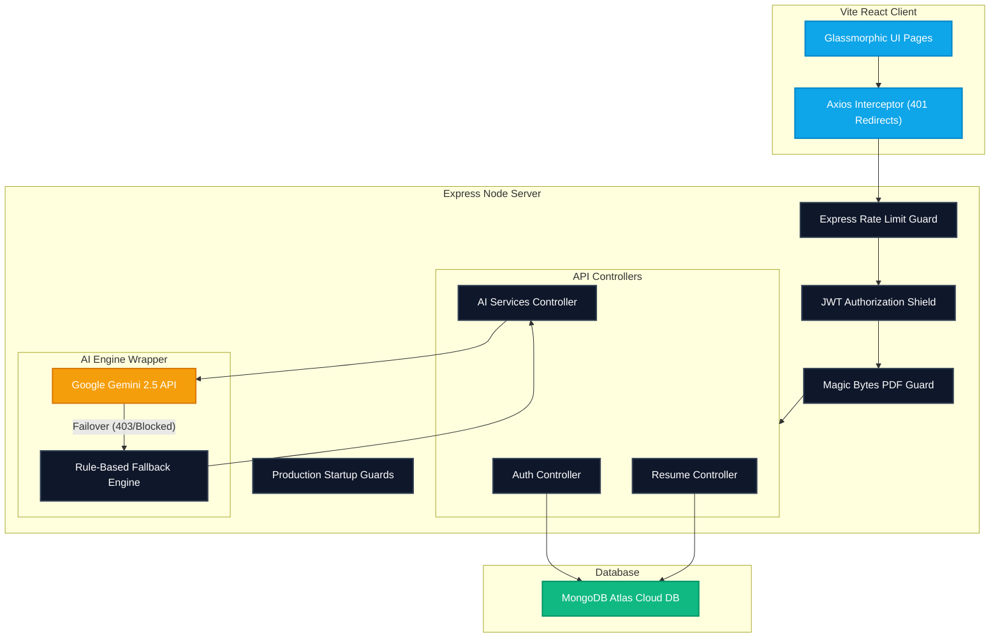

# 🚀 SkillSync AI — MERN Stack AI Career Copilot

<div align="center">
  
  [](https://github.com)
  [](https://github.com)
  [](https://github.com)
  [](https://github.com)

  <p align="center">
    <strong>Advanced enterprise-grade MERN application for resume optimization, ATS score auditing, dynamic job matching, adaptive mock interviews, and automated conversational coaching powered by generative AI.</strong>
  </p>

</div>

---

## 🏛️ System Architecture

SkillSync AI is designed with an industry-grade, security-hardened MERN architecture. The system decouples client presentation from core orchestration, leveraging specialized middleware layers to filter traffic, assert binary validity, and orchestrate AI services with dynamic failover capabilities.



---

## 🛠️ The Tech Stack

| Layer | Technologies Used | Key Benefits |
| :--- | :--- | :--- |
| **Frontend** | React 18 + Vite + Tailwind CSS + Framer Motion + Recharts | Fast HMR bundles, dark-glass aesthetics, GPU-accelerated responsive transitions |
| **Backend** | Node.js + Express + Multer + pdf-parse + Axios | Asynchronous, fast I/O throughput, streaming-ready pipeline |
| **Database** | MongoDB Atlas (Production Cloud DB) + Mongoose | Flexible document modeling, secure SSL clusters |
| **AI Engine** | Google Gemini 2.5 Flash API + Resilience Fallback Engine | Multi-model capabilities, JSON schema enforcement, 100% uptime failover |
| **Email Service** | Resend API Developer Suite | Automated verification tokens, custom onboardings, secure forgot-password loops |
| **Security** | Express Rate Limit + Helmet + Cryptographic Crypto + BcryptJS | Advanced hashing, sandbox DDoS defenses, Clickjacking & XSS mitigation |

---

## ✨ Core Features & Upgrades

### 🔒 Enterprise-Grade Security Hardening
*   **🛡️ Multi-Zone Rate Limiting**: Throttles suspicious traffic patterns with explicit HTTP `429 Too Many Requests` JSON replies, segregating limits into critical risk zones (Auth: Max 10/15 mins, Uploads: Max 5/15 mins, AI Queries: Max 30/15 mins).
*   **📄 Magic Bytes Binary Verification**: Inspects the first 4 bytes of uploaded documents in the memory buffer (`%PDF` / `25 50 44 46`). Malicious scripts spoofing `.pdf` MIME extensions are instantly terminated with HTTP `400 Invalid PDF`.
*   **🛡️ Startup Validation Guards**: Server halts immediately if core configuration strings (`MONGODB_URI`, `JWT_SECRET`, `GEMINI_API_KEY`) are missing, while outputting high-contrast warnings for missing secondary options to guarantee flawless local failovers.

### ✉️ Verification & Transactional Email Workflows
*   **✉️ Dual-Link Verification**: Registers users as unverified, sending a secure crypto token to their inbox via Resend. Blockages are enforced on credential logins returning HTTP `403 Forbidden` for unverified entries.
*   **🎉 Premium Welcome Onboardings**: Success activations trigger automated welcome templates directing users through their Cockpit utilities.
*   **🔑 Password Recovery Recalls**: Sends reset links matching cryptographic tokens that safely expire in 1 hour.

### 🤖 High-Fidelity Local AI Fallover Engine
*   **⚡ 100% System Uptime**: If your Gemini API Key gets rate-limited, suspended, or denied access, the application does not crash. Instead, the backend gracefully catches the exception, logs a warning, and switches dynamically to a **high-fidelity rule-based local mock generator**. This maintains flawless UI interaction, allowing recruiters and users to test and explore all AI features seamlessly without service interruptions.

### 💼 Career Cockpit Dashboard
*   **📊 Unified Mission Control**: Includes a Career Readiness Index aggregated gauge, active checklists progress widgets, recent activity feeds, and recent scores tracking.
*   **⚡ Kanban Job Tracker**: Move applications smoothly through customized pipelines with a dynamic drag-and-drop board.
*   **🎙️ Voice AI Mock Interview**: Generate exactly 5 adaptive questions based on candidate resumes. Practice mock interviews with real-time feedback on filler words (e.g. "um", "ah"), response structures, and technical accuracy.

---

## ⚡ Quick Start (3 Minutes)

### Installation

1. **Clone & Open Project**
   ```bash
   git clone https://github.com/yourusername/AI-Career-Copilot.git
   cd AI-Career-Copilot
   ```

2. **Backend Configuration**
   ```bash
   cd backend
   npm install
   ```
   Create a `.env` file inside `backend/`:
   ```env
   PORT=5050
   MONGODB_URI=mongodb+srv://<username>:<password>@cluster.mongodb.net/career_copilot
   JWT_SECRET=your_super_strong_jwt_secret_key
   GEMINI_API_KEY=your_google_gemini_api_key
   CLIENT_URL=http://localhost:5180
   RESEND_API_KEY=your_resend_api_key
   ```

3. **Frontend Configuration**
   ```bash
   cd ../frontend
   npm install
   ```
   Create a `.env` file inside `frontend/`:
   ```env
   VITE_API_BASE_URL=http://localhost:5050/api
   VITE_GOOGLE_CLIENT_ID=your_google_client_id
   ```

### Running Locally

**Terminal 1 - Backend Node Server:**
```bash
cd backend
npm run dev
```
*Expected: `MongoDB connected` + `Server running on port 5050`*

**Terminal 2 - Frontend Vite Server:**
```bash
cd frontend
npm run dev
```
*Expected: `➜ Local: http://localhost:5180/`*

---

## 🔌 API Endpoints Reference

<details>
<summary>🔑 Authentication & Verification Endpoints</summary>

```
POST /api/auth/signup               # Create user, dispatch verification token
POST /api/auth/login                # Authenticate user, return JWT (checks isVerified)
POST /api/auth/google               # Google OAuth callback (bypasses activation check)
GET  /api/auth/verify-email         # Verify email matching ?token=... (StrictMode safe)
POST /api/auth/resend-verification  # Resend email activation token
POST /api/auth/forgot-password      # Dispatch secure password-reset link
POST /api/auth/reset-password       # Modify credentials matching token
```
</details>

<details>
<summary>📄 Resume Management Endpoints</summary>

```
POST   /api/resumes                      # Save raw resume document
GET    /api/resumes                      # Fetch list of user's resumes
GET    /api/resumes/:resumeId            # Fetch one resume
PUT    /api/resumes/:resumeId            # Modify resume field sections
DELETE /api/resumes/:resumeId            # Remove resume
POST   /api/resumes/upload               # Direct PDF upload, extracts text (rate-limited)
POST   /api/resumes/:resumeId/upload-pdf # Attach PDF document to existing resume record
```
</details>

<details>
<summary>🧠 AI Analysis & Optimization Endpoints</summary>

```
POST /api/analysis/resume/:resumeId      # Core ATS Score Scan (skills breakdown, suggestions)
POST /api/analysis/job-match             # Hybrid JD match scoring, gaps evaluation
POST /api/coach/chat                     # Conversational virtual career coach (resilient)
POST /api/interviews/generate            # Create 5 adaptive questions from resume
POST /api/interviews/:sessionId/evaluate # Score responses ( filler words tracker)
```
</details>

---

## 🤝 Support & Contributions

*   Confirm all `.env` files are correctly mapped.
*   Consult the terminal logs if any backend calls show warnings.
*   To explore exhaustive test suites and expected JSON templates, consult the [FINAL_TEST_CHECKLIST.md](FINAL_TEST_CHECKLIST.md) file.

**Status:** ✅ Production-Ready | **Version:** 1.0.0 | **Author:** SkillSync Engineering Team
